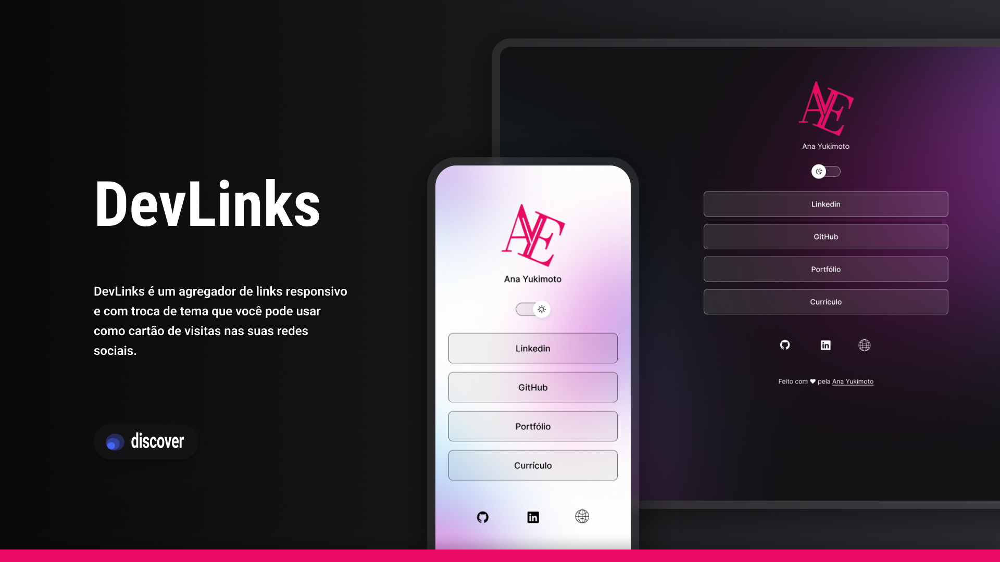

# DevLinks

Bem-vindo ao repositório do DevLinks! 

Este projeto foi concebido durante a jornada educacional com o curso Discover da Rocketseat. O devLinks é uma aplicação simples, porém útil, que permite centralizar links relevantes para desenvolvedores, além de proporcionar uma introdução prática ao universo do Git e do GitHub. Todo o projeto foi inicialmente esboçado e prototipado no Figma, garantindo uma base sólida para seu desenvolvimento.

## 🚀 Tecnologias Utilizadas

O projeto utiliza as seguintes tecnologias:

      

## 🔗 Acesso ao Projeto

- Acessar a versão hospedada do Projeto por [aqui](https://anayukimoto.github.io/devLinks/).

- Acessar a versão Figma do projeto por [aqui](https://www.figma.com/file/u5mQUJkz1Vetny6k8vJOW1/DevLinks-%E2%80%A2-Projeto-Discover-(Ana-Yukimoto)?type=design&node-id=10%3A620&mode=design&t=2D43hXkMFFzd1AHO-1).

##
Ana Yukimoto
